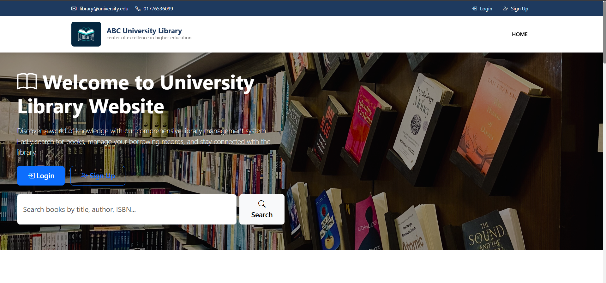
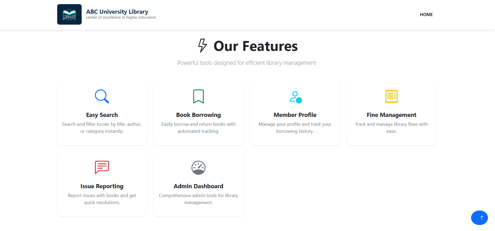
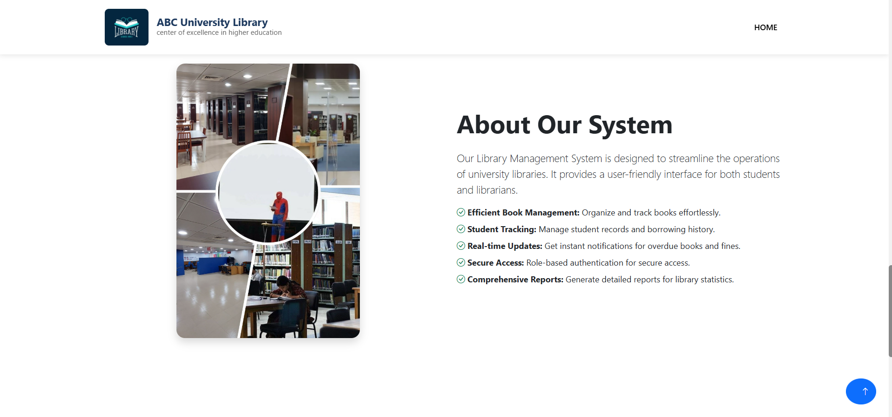

<div align="center">
  <h1>📚 Library Management System</h1>
  <p>
    A modern, feature-rich library management system with payment integration, built with Django and MySQL.
  </p>
  
  [](https://www.python.org/)
  [](https://www.djangoproject.com/)
  [](https://www.mysql.com/)
  [](LICENSE)
  
  <div style="margin: 20px 0; text-align: center;">
    
  </div>
  
  <div style="display: flex; justify-content: center; gap: 20px; margin: 30px 0; flex-wrap: wrap;">
    <div style="flex: 1; min-width: 45%;">
      
    </div>
    <div style="flex: 1; min-width: 45%;">
      
    </div>
  </div>
</div>

## ✨ Key Features

### 👥 For Everyone
- 🌐 **Intuitive Interface**: Clean, responsive design for all devices
- 🔍 **Advanced Search**: Find books by title, author, or category
- 📊 **Smart Sorting**: Sort books alphabetically or by availability

### 👨‍🎓 For Students
- 🔐 **Secure Authentication**: Signup/Login with validation
- 📚 **Easy Book Requests**: Simple process to request books
- 📱 **Track Status**: Monitor book issues (requested/issued/returned)
- 💳 **Online Payments**: Pay fines securely via payment integration

### 👨‍💼 For Administrators
- 📊 **Comprehensive Dashboard**: Real-time statistics and insights
- 📚 **Book Management**: Add, edit, and remove books and authors
- 🎓 **Student Management**: Manage students by department
- ⚡ **Efficient Processing**: Handle book requests and returns with ease
- 💰 **Fine Management**: Automatic fine calculation and tracking

## 🚀 Getting Started

### Prerequisites
- Python 3.8 or higher
- MySQL Server 8.0+
- bKash Merchant Account (for payment processing)

### Installation

1. **Clone the repository**
   ```bash
   git clone https://github.com/yourusername/library-management-system.git
   cd library-management-system
   ```

2. **Set up virtual environment**
   ```bash
   # Windows
   python -m venv venv
   .\venv\Scripts\activate
   
   # Mac/Linux
   python3 -m venv venv
   source venv/bin/activate
   ```

3. **Install dependencies**
   ```bash
   pip install -r requirements.txt
   ```

4. **Configure environment variables**
   ```bash
   cp .env.example .env
   # Edit .env with your configuration
   ```

5. **Set up database**
   ```sql
   CREATE DATABASE library_management;
   ```

6. **Run migrations**
   ```bash
   python manage.py migrate
   ```

7. **Create superuser**
   ```bash
   python manage.py createsuperuser
   ```

8. **Run development server**
   ```bash
   python manage.py runserver
   ```

9. **Access the application**
   - Main application: http://127.0.0.1:8000/
   - Admin panel: http://127.0.0.1:8000/admin/

## � Application Endpoints

| Section | URL | Description |
|---------|-----|-------------|
| Home | `/` | Landing page with book listings |
| Authentication | `/login/` | User login |
|  | `/signup/` | New user registration |
| Student | `/student/dashboard/` | Student dashboard |
|  | `/student/issues/` | View book issues |
|  | `/student/fines/` | Check and pay fines |
| Admin | `/admin/dashboard/` | Admin control panel |
|  | `/admin/books/` | Manage books and authors |
|  | `/admin/students/` | Manage student accounts |
|  | `/admin/fines/` | Manage fine records |

## ⚙️ Configuration

### bKash Payment Integration
1. Register at [bKash Developer Portal](https://developer.bka.sh/)
2. Create a new application
3. Obtain your credentials:
   - App Key
   - App Secret
   - Username
   - Password
4. Update these in your `.env` file

### Database Configuration
- **Type**: MySQL
- **Name**: library_management
- Update the following in `.env`:
  ```
  DB_NAME=library_management
  DB_USER=your_username
  DB_PASSWORD=your_password
  DB_HOST=localhost
  DB_PORT=3306
  ```

## 📊 Database Schema

### Core Tables
- **Author**
  - id, name, bio, created_at, updated_at

- **Book**
  - id, title, author (FK), isbn, quantity, available, created_at, updated_at

- **Student**
  - id, user (OneToOne), department, student_id, phone, created_at, updated_at

- **IssueRequest**
  - id, student (FK), book (FK), status, issue_date, return_date, created_at

- **Fine**
  - id, issue (FK), amount, status, payment_date, bKash_trxID, created_at

## 👨‍💻 Developer

**Farhin Ahmed Pranto**  
[](mailto:farhinahmed71@gmail.com)

## 📄 License

This project is licensed under the MIT License - see the [LICENSE](LICENSE) file for details.

## 🙌 Contributing

Contributions are welcome! Please feel free to submit a Pull Request.

## 📬 Support

For support, please contact [farhinahmed71@gmail.com](mailto:farhinahmed71@gmail.com) or open an issue on GitHub.

---

<div align="center">
  Made with ❤️ for academic purposes
</div>